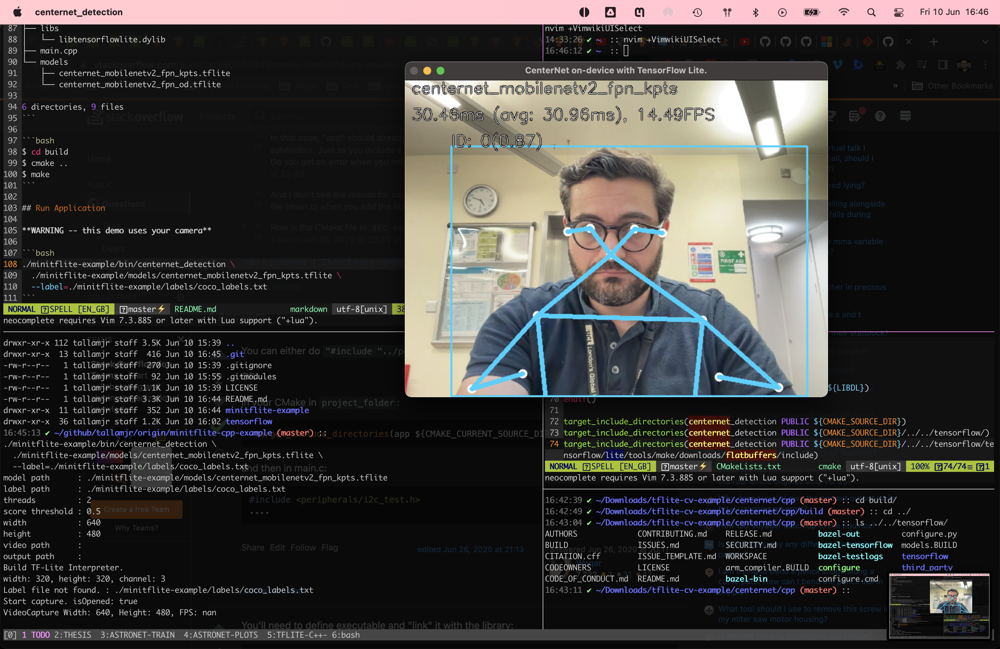

# Minimal TFLite example using C++ API

These instructions are written using an Apple Mac Pro M1.

## Download Tools

`bazelisk` is recommended for building the project, which can be done with `brew`:

```bash
brew install bazelisk
```

## Compile and Build TFLite

1. Change directory into `tensorflow` and run: `./configure`

* I just use the default Python options, but for these other options I select no:

```bash
You have bazel 5.1.1 installed.
Please specify the location of python. [Default is /Users/tallamjr/mambaforge/envs/main/bin/python3]:

Found possible Python library paths:
  /Users/tallamjr/github/tallamjr/origin/astronet
  /Users/tallamjr/mambaforge/envs/main/lib/python3.10/site-packages
  /opt/homebrew/Cellar/apache-spark/3.2.1/libexec/python
Please input the desired Python library path to use.  Default is [/Users/tallamjr/github/tallamjr/origin/astronet]

Do you wish to build TensorFlow with ROCm support? [y/N]: N
No ROCm support will be enabled for TensorFlow.

Do you wish to build TensorFlow with CUDA support? [y/N]: N
No CUDA support will be enabled for TensorFlow.

Do you wish to download a fresh release of clang? (Experimental) [y/N]: N
Clang will not be downloaded.

Please specify optimization flags to use during compilation when bazel option "--config=opt" is specified [Default is -Wno-sign-compare]:

Would you like to interactively configure ./WORKSPACE for Android builds? [y/N]: N
Not configuring the WORKSPACE for Android builds.

Do you wish to build TensorFlow with iOS support? [y/N]: N
```

2. Now build with:

```bash
$ bazel build -c opt //tensorflow/lite:libtensorflowlite.dylib
```

3. Check TFLite library file

```bash
$ file tensorflow/bazel-bin/tensorflow/lite/libtensorflowlite.dylib

bazel-bin/tensorflow/lite/libtensorflowlite.dylib: Mach-O 64-bit dynamically linked shared library arm64
```

## Make Application

From here, we simply move the necessary files into a directory that we will eventually "deploy". So,
for this to work we need to ensure we have the compiled binary: `centernet_detection`, the TFLite
model: `centernet_mobilenetv2_fpn_kpts.tflite` and the sample input data: `coco_labels.txt`
(although even this is not required since we could construct our application to take input from the
user at runtime)


```bash
$ cp -r tensorflow/bazel-bin/external/flatbuffers/_virtual_includes/flatbuffers minitflite-example/include/
$ cp -r tensorflow/tensorflow/lite minitflite-example/include/tensorflow/
$ cp tensorflow/bazel-bin/tensorflow/lite/libtensorflowlite.dylib minitflite-example/libs/
```

```bash
$ tree minitflite-example -L 3 -I "CMakeCache.txt|CMakeFiles"
minitflite-example
├── CMakeLists.txt
├── bin
│   ├── Makefile
│   ├── centernet_detection
│   └── cmake_install.cmake
├── centernet_detector.cpp
├── centernet_detector.h
├── include
│   ├── flatbuffers
│   │   └── flatbuffers
│   └── tensorflow
│       └── lite
├── inputs
│   └── coco_labels.txt
├── libs
│   └── libtensorflowlite.dylib
├── main.cpp
└── models
    ├── centernet_mobilenetv2_fpn_kpts.tflite
    └── centernet_mobilenetv2_fpn_od.tflite

9 directories, 11 files
```

```bash
$ cd build
$ cmake ..
$ make
```

## Run Application

**WARNING -- this demo uses your camera**

```bash
./minitflite-example/bin/centernet_detection \
  ./minitflite-example/models/centernet_mobilenetv2_fpn_kpts.tflite \
  --label=./minitflite-example/labels/coco_labels.txt
```



## Inspect Storage Sizes

I am ignoring the submodule of tensorflow since what's really used for deployment will be in
`minitflite-example` folder.

```bash
$ du -sh */** | grep -v "tensorflow|assets" | sort -rh
 52M    minitflite-example/include
 18M    minitflite-example/models
3.6M    minitflite-example/libs
676K    minitflite-example/bin
 12K    minitflite-example/main.cpp
8.0K    minitflite-example/centernet_detector.cpp
4.0K    minitflite-example/inputs
4.0K    minitflite-example/centernet_detector.h
4.0K    minitflite-example/CMakeLists.txt

```
